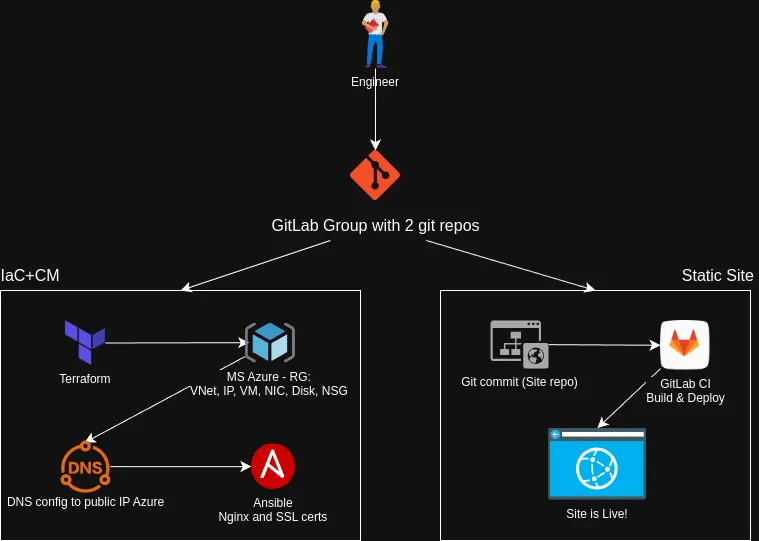

# Getting started with DevOps

#### Code repository for [this article](https://vincenzocampagnano.com/blog/devops-journey).

## Pipeline


- IaC and CM is easy to understand following the codebase
- The Static Site repository is maintained by the engineer/developer that _Plan->Design->Develop->Test->Integrate_
- Each commit trigger the **GitLab pipeline** executed by a GitLab Runner (self-hosted or instance): it _Build_ the Static Site (testing/linting/pretting as well) then _Deploy_ the output to the VM on Azure Cloud
> In this way we guarantee a seamlessly Development and Operations

## Structure
```
├── .gitlab-ci.yml (to put in your static site repository)
├── ansible
│   ├── inventory
│   ├── playbook.yml
│   └── roles
│       ├── ssl
│       │   ├── files
│       │   │   └── private.key.pem (your)
│       │   │   └── domain.cert.pem (your)
│       │   │   └── vincenzocampagnano.com
│       │   └── tasks
│       │       └── main.yml
│       └── web
│           ├── files
│           │   └── index.html
│           └── tasks
│               └── main.yml
├── LICENSE
├── README.md
└── terraform
    ├── backend.tf.example
    ├── main.tf
    ├── outputs.tf
    ├── state-backend.tf
    ├── terraform.tfvars.example
    └── variables.tf

9 directories, 14 files
```
## Pre-requisites
- Terraform
- Ansible
- Azure subscription
- Azure CLI
- Your domain from Porkbun (or other provider)

## Usage
1. **Configure your `terraform.tfvars` as in the example**
2. **Authenticate with Azure**  
    - Authenticated with `az login`  
    - Create a service principal (SP) for Terraform:
        ```
        az ad sp create-for-rbac --role="Contributor" --scopes="/subscriptions/<your-subscription-id>"
        ```
        Take note of *appId*, *password*, *tenant* (*displayName* is useless).
3. **Running Terraform Commands**  
    - Use env variables to authenticate (safely)
        ```
        export ARM_CLIENT_ID="<appId>"
        export ARM_CLIENT_SECRET="<password>"
        export ARM_TENANT_ID="<tenant>"
        export ARM_SUBSCRIPTION_ID="<subscriptionId>"
        ```
    - After configuring everything, you ran:  
        ```bash
        terraform init
        terraform plan
        terraform apply
        ```
4. **DNS Configuration with Porkbun domain**  
    After provisioning, we retrieved the public IP from the Terraform outputs. Next, you logged into your Porkbun account and added two A records:
    - `@` pointing to the VM’s public IP.
    - `www` pointing to the same IP.

    This setup links your purchased domain (e.g., vincenzocampagnano.com) to the Azure VM.
5. **Server Configuration with Ansible**  
    The playbook is designed to:
    - Install and start NGINX.
    - Deploy a placeholder `index.html` to `/var/www/html`.
    - Configure HTTPS.  

    Before to start it, you need to:
    - Add yours `domain.cert.pem` and `private.key.pem` in the folder `ansible/roles/ssl/files` (SSL bundle provided by Porkbun or your domain provider).
    - Configure the `inventory`, `roles/ssl/tasks/main.yml` and `ansible/roles/ssl/files/vincenzocampagnano.com` with your info.  
    - Then you can run `ansible-playbook -i inventory playbook.yml`.
6. **Automating the Build and Deploy with GitLab CI/CD**  
    As explained in [the article](https://vincenzocampagnano.com/blog/devops-journey) I have two repositories. One is similar to this one and in the other repository there is the static site, **in my case it is [Tailwind Next.js Starter Blog](https://github.com/timlrx/tailwind-nextjs-starter-blog)**.  
    So following their instruction to deploy on a private server, I set up a `.gitlab-ci.yml`. 
    - **You should put this file in your own static site repository.**
    - **Configura le variabili CI/CD su GitLab**  
        Go to the site-static repo on GitLab.
        Go to Settings > CI/CD > Variables and Add:  
        - SSH_PRIVATE_KEY key: paste the entire private key (e.g.: ~/.ssh/id_rsa)
        - (Any other custom variables such as BASE_PATH if necessary)

        Ensure that:
        - The private key has no passphrase, or it also configures SSH_PASSPHRASE
        - The user devops on the VM has the public key in ~/. ssh/authorized_keys
    - **Push to `main`, and boom—it’s live.**


**Optional**: To store terraform state in Cloud on Azure Blob Storage configure `state-backend.tf` and `backend.tf`. The run `terraform init -reconfigure` and confirm the change.


## License
This project is licensed under the GNU General Public License (GPL).  
You are free to use, modify, and distribute this software under the terms of the GPL, ensuring that derivative works are also open-source.
